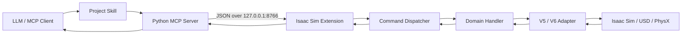
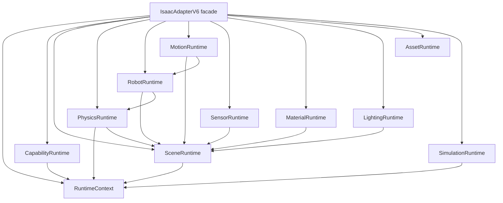

# Architecture

IsaacSim-MCP 把 agent guidance、protocol transport、runtime integration 與 Isaac Sim API compatibility 分層，讓每一層只有一個主要責任。

```text
LLM → Skill → MCP Server → TCP → Isaac Extension → Handler → Adapter → Isaac Sim
```



## 各層責任

| Layer | 位置 | 責任 |
|---|---|---|
| Skill | `.agents/skills/omniverse-windows-workspace/` | 判斷任務類型、選擇 documentation/code/live route，只載入需要的 1.x～6.x reference。 |
| MCP Server | `isaac_mcp/` | 提供 named tools、驗證 public inputs、正規化 response，並連線到 runtime socket。 |
| TCP transport | `isaac_mcp/connection.py` 與 extension server | 透過 loopback TCP `8766` 傳輸 bounded JSON request/response。 |
| Isaac Extension | `isaac.sim.mcp_extension/` | 在 Kit 內執行、註冊 commands、套用 governance 並派送 runtime 工作。 |
| Handler | `isaac_sim_mcp_extension/handlers/` | 實作 domain workflow、prerequisites、rollback、lifecycle 與 read-back。 |
| Adapter | `isaac_sim_mcp_extension/adapters/` | 隔離不同 Isaac Sim version 與 backend API。 |
| Isaac Sim | 外部 runtime | 持有 USD Stage、timeline、sensor、physics、graph、Replicator、robot 與 assets。 |

## IsaacAdapterV6 runtime composition

`IsaacAdapterV6` 是64個public methods的explicit facade。Handler只看facade，不import `v6_runtime`；domain component只處理Isaac Sim 6.x integration與自己的state owner。



| Component | State / responsibility |
|---|---|
| `RuntimeContext` | stage access、Isaac version與live backend detection；不持有MCP policy。 |
| `CapabilityRuntime` | V6 backend matrix資料；high-level capability response仍由handler組裝。 |
| `SceneRuntime` | discovery、reference、prim authoring與transform read/write。 |
| `PhysicsRuntime` | SimulationManager bridge、physics scene/body/group/joint、params read-back與rollback。 |
| `RobotRuntime` | articulation cache、joint state/command、drive config與controller integration。 |
| `MotionRuntime` | IK/planning、trajectory store、motion jobs、update subscription與terminal cleanup。 |
| `SensorRuntime` | camera/LiDAR caches、metadata、render request與sensor lifecycle。 |
| `MaterialRuntime` | visual/physics material authoring、binding read-back與rollback。 |
| `LightingRuntime` | light creation與mutation。 |
| `AssetRuntime` | prim clone與Isaac Sim 6 two-step URDF import。 |
| `SimulationRuntime` | timeline、exact physics step、state、bounded script execution/reload與ScriptNode recompile。 |

Facade只保留composition、explicit forwarding與真正跨domain的timeline-stop coordination。Policy bridges使用weak reference回到facade，保留base policy、ABC/introspection與monkeypatch targets，同時避免component反向擁有facade。

Graph、ROS2、Replicator與Human目前仍由handler擁有：raw Isaac API與stable errors、ownership、job/artifact或workflow orchestration尚未形成可獨立搬移的邊界。這四個domain延後到Phase F，沒有建立空runtime。

## Request lifecycle

1. MCP client 從 server registry 選擇 named tool。
2. Server 驗證輸入，加入 correlation／idempotency metadata 後序列化 command。
3. Extension dispatcher 套用 request size、policy、timeout 與 response limits。
4. Domain handler 檢查 timeline、ownership、extension、backend 與 scratch-stage prerequisites。
5. Adapter 呼叫受支援的 Isaac Sim API，回傳 typed runtime data。
6. Handler 執行 read-back 或 rollback，共用 response layer 回傳 stable envelope。

Transport success 不代表 Stage 已改變。Write acceptance 必須有 operation-specific read-back；live verification 也需依功能檢查 cleanup、Kit health、TCP health、logs 與 native dumps。

## Runtime routes

- `isaac-sim-live` 透過本 repository 與 TCP `8766` 控制 running Stage。
- NVIDIA documentation MCP services 只回答 API 與文件問題，不構成 live Stage evidence。
- `execute_script`／`reload_script` 是受 governance 限制的 escape hatch。穩定且可測試的操作優先使用 named tools。

## 權威來源

Tool inventory、version、capability 與 evidence 各有不同權威來源。修改 public tools 或宣稱目前支援狀態前，先讀 [Authority and Generated Metadata](docs/reference/AUTHORITY.md)。

## Safety boundaries

- Live writes 只進入明確的 MCP-owned scratch namespace；若要修改使用者 Stage，必須指定目標並取得授權。
- Timeline、backend、extension、ownership 與 path prerequisites 全部 fail closed。
- PhysX/Newton 支援狀態由 active adapter capability matrix 決定，不能用 import success 或共用 USD schema 推論。
- Release 需要 verified backup、clean strict release gate、exact remote verification 與明確 publish 授權。
