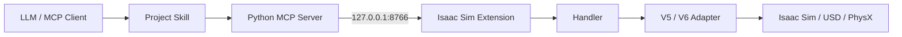

# IsaacSim-MCP

IsaacSim-MCP 讓支援 MCP 的 AI client 透過具名、可驗證的 tools 控制 NVIDIA Isaac Sim。涵蓋 USD 場景、機器人、感測器、物理、Action Graph、ROS 2、Replicator SDG、動畫人物、NVIDIA 資產與模擬控制。

主要驗證環境是 Windows 與 Isaac Sim 6.0.1。本專案延伸自 [whats2000/isaacsim-mcp-server](https://github.com/whats2000/isaacsim-mcp-server)，沿用 MIT License。

## Table of Contents

- [核心功能](#核心功能)
- [架構](#架構)
- [Installation](#installation)
- [Configuration](#configuration)
- [Running IsaacSim-MCP](#running-isaacsim-mcp)
- [Remote MCP Access](#remote-mcp-access)
  - [Tailscale Funnel](#tailscale-funnel)
  - [ChatGPT MCP Connector](#chatgpt-mcp-connector)
- [支援版本](#支援版本)
- [文件入口](#文件入口)
- [Safety 與 verification](#safety-與-verification)
- [Troubleshooting](#troubleshooting)
- [Development](#development)
- [License](#license)

## 核心功能

- 建立、查詢、變形、組合、儲存與驗證 USD Stage。
- 控制 articulation、joint drive、motion planning、gripper 與 mobile base。
- 在 Stage／robot replacement 後重建失效的 physics tensor 與 articulation binding，並保持 joint name/value 對應一致。
- 擷取 Camera RGB 與 typed RTX outputs；RGB 可選擇 MCP-native `ImageContent`，供支援影像內容的遠端 client 顯示或交給 vision model。
- 建立 PhysX scene、body、collider、joint、PBR material 與 physics material。
- 管理 Action Graph、ScriptNode、ROS 2 publisher、Replicator SDG job 與 human behavior lifecycle。
- 透過 managed artifact 傳輸大型輸出，支援 hash、bounded chunk、TTL 與 cleanup。
- 提供 command ID、idempotency、policy limit、job、cancel、read-back、rollback 與 redacted diagnostics。

[MCP Tool Inventory](docs/reference/TOOL_INVENTORY.md) 由 source decorators 自動產生；[Tool profiles](docs/reference/TOOL_PROFILES.md) 說明 129-tool 相容模式與 98-tool 合併模式。目前 runtime 支援狀態以 `get_capabilities` 為準。

## 架構

```text
LLM → Skill → MCP Server → TCP → Isaac Extension → Handler → Adapter → Isaac Sim
```



各層責任、request lifecycle、runtime routes 與權威來源見 [ARCHITECTURE.md](ARCHITECTURE.md)。

## Installation

安裝 MCP Server：

```powershell
git clone https://github.com/Tim0320/IsaacSim-MCP.git
cd IsaacSim-MCP
py -3.10 -m venv .venv
.\.venv\Scripts\python.exe -m pip install --upgrade pip
.\.venv\Scripts\python.exe -m pip install -e .
```

Windows 的完整環境需求與安裝方式見 [Windows 安裝指南](docs/getting-started/INSTALLATION_WINDOWS.md)。

## Configuration

stdio 是預設 transport。Codex／Claude Desktop 可以沿用現有設定，不需要新增 HTTP 環境變數：

```json
{
  "mcpServers": {
    "isaac-sim-live": {
      "command": "F:\\IsaacSim-MCP\\.venv\\Scripts\\python.exe",
      "args": ["-m", "isaac_mcp.server"],
      "env": {
        "ISAAC_MCP_HOST": "127.0.0.1",
        "ISAAC_MCP_PORT": "8766"
      }
    }
  }
}
```

Streamable HTTP 使用另一組設定：

| Variable | Default | Purpose |
|---|---|---|
| `ISAAC_MCP_TRANSPORT` | `stdio` | 設為 `streamable-http` 或 alias `http` 以啟用 HTTP transport。 |
| `ISAAC_MCP_HTTP_HOST` | `127.0.0.1` | MCP HTTP listener address。 |
| `ISAAC_MCP_HTTP_PORT` | `8000` | MCP HTTP listener port。 |
| `ISAAC_MCP_TOOL_PROFILE` | `legacy` | `legacy` 保留既有 129 tools；`consolidated` 提供 98-tool 合併 surface；`full` 僅供遷移與測試。 |
| `MCP_ALLOWED_HOSTS` | 未設定 | 額外允許送到 HTTP endpoint 的 exact Host header，以逗號分隔；loopback hosts 永遠保留。 |
| `ISAAC_MCP_RUNTIME_STATE_FILE` | `%LOCALAPPDATA%\IsaacSim-MCP\runtime-state.json` | Supervisor 與 MCP Server 共用的 bounded crash/restart 狀態檔。 |
| `ISAAC_MCP_RUNTIME_PROBE_TIMEOUT_SECONDS` | `1` | `get_runtime_status` protocol health probe timeout。 |

`ISAAC_MCP_HOST=127.0.0.1` 與 `ISAAC_MCP_PORT=8766` 仍屬於 Python MCP Server 和 Isaac Sim Extension 間的 runtime TCP socket。不要把它們改成 HTTP endpoint 設定。

### Tool profiles

預設 `legacy` 不改任何既有 tool name 或 schema。ChatGPT 等需要較小 action space 的 client，可在啟動 MCP Server 前設定：

```powershell
$env:ISAAC_MCP_TOOL_PROFILE = "consolidated"
```

`consolidated` 用 `action` 或 `publisher_type` 合併同一資源的讀寫／控制操作，公開 98 tools。它只調整 MCP tool surface，仍呼叫原本的 Isaac Extension commands。修改 profile 後必須重新啟動 MCP Server，讓 client 重新取得 tool list。完整對照見 [Tool profiles](docs/reference/TOOL_PROFILES.md)。

`.env.example` 只列出可用設定，server 不會自動載入它。請在啟動 `python -m isaac_mcp.server` 的同一個 process environment 設定 profile。啟動後可用 MCP `tools/list` 與 `get_capabilities.data.mcp_server` 核對實際公開 surface；`consolidated` 應回報 98 tools。

## Running IsaacSim-MCP

建議用 supervisor 啟動 Isaac Sim 與 Extension：

```powershell
$env:ISAACSIM_ROOT = "C:\isaacsim"
.\scripts\run_isaac_sim_supervised.ps1
```

Supervisor 會沿用既有 launcher 的 Isaac Sim 6.0.1、Extension、port 與 Physics GPU guard。非零 exit code 視為異常退出，預設最多在 300 秒內重啟 3 次並使用 exponential backoff；exit code `0` 視為正常關閉，不會自動重開。啟動前若 protocol health probe 已找到健康 runtime，或 `8766` 已被無回應程序占用，supervisor 都會拒絕再啟動一份 Isaac Sim。需要 one-shot 行為時仍可使用 `.\scripts\run_isaac_sim.ps1`。

Supervisor 與 MCP Server 是兩個獨立程序。Codex／Claude 仍由 client 用 stdio 啟動 `isaac_mcp.server`；Streamable HTTP 仍用下方命令啟動。Supervisor 狀態預設寫入 `%LOCALAPPDATA%\IsaacSim-MCP\runtime-state.json`，不包含 environment、command source 或 log 內容。

當 Isaac Sim crash、正在重啟或超過 restart budget 時，MCP tools 會回傳 `ISAAC_RUNTIME_RECOVERING`、`ISAAC_RUNTIME_CRASHED` 或 `ISAAC_RUNTIME_UNAVAILABLE`。呼叫 `get_runtime_status` 可在 `8766` 關閉時讀到 exit code、時間、attempt、restart count、health 狀態與建議動作。Connection loss 後不會自動 replay write；runtime 恢復後必須先 read-back，再決定是否用原 idempotency key 重送。

完整 process ownership、state schema、restart budget 與 Agent recovery contract 見 [Runtime supervision 與 crash recovery](docs/concepts/RUNTIME_SUPERVISION.md)。

本機 Codex／Claude Desktop 會依上一節設定，以 stdio 自動啟動 MCP Server。需要 Streamable HTTP 時，在另一個 PowerShell session 啟動：

```powershell
$env:ISAAC_MCP_TRANSPORT = "streamable-http"
$env:ISAAC_MCP_HTTP_HOST = "127.0.0.1"
$env:ISAAC_MCP_HTTP_PORT = "8000"
$env:ISAAC_MCP_TOOL_PROFILE = "consolidated"
$env:MCP_ALLOWED_HOSTS = "localhost,127.0.0.1"

.\.venv\Scripts\python.exe -m isaac_mcp.server
```

MCP HTTP endpoint 是 `http://127.0.0.1:8000/mcp`。先呼叫 `get_capabilities`，再呼叫 `get_scene_info`，確認 runtime 與 Stage 後才執行 write。

## Remote MCP Access

IsaacSim-MCP 預設只在本機使用。ChatGPT 等雲端 MCP client 無法直接連到 `localhost`、`127.0.0.1` 或 `192.168.x.x` 私有位址。它們需要能從 public internet 存取的 HTTPS endpoint，例如 Tailscale Funnel：

```text
ChatGPT
   ↓ HTTPS
Public MCP Endpoint
   ↓
IsaacSim-MCP
   ↓ TCP 127.0.0.1:8766
Isaac Sim
```

| Method | Tailnet only | Public Internet | ChatGPT can access |
|---|---:|---:|---:|
| localhost | No | No | No |
| Tailscale Serve | Yes | No | No |
| Tailscale Funnel | Yes | Yes | Yes |

[Tailscale Serve](https://tailscale.com/docs/features/tailscale-serve) 只把服務提供給同一個 tailnet；[Tailscale Funnel](https://tailscale.com/docs/features/tailscale-funnel) 會建立 public internet 可達的 HTTPS endpoint。ChatGPT MCP Connector 需要 Funnel 或其他 public HTTPS deployment。

### Tailscale Funnel

1. 從 [Tailscale Download](https://tailscale.com/download) 安裝適合目前作業系統的版本，登入後啟用本機 Tailscale：

   ```bash
   tailscale up
   ```

2. 啟動 Isaac Sim Extension，接著在 repository 根目錄啟動 Streamable HTTP server。將範例 hostname 換成 `tailscale funnel` 顯示的完整 hostname：

   ```powershell
   $env:ISAAC_MCP_TRANSPORT = "streamable-http"
   $env:ISAAC_MCP_HTTP_HOST = "127.0.0.1"
   $env:ISAAC_MCP_HTTP_PORT = "8000"
   $env:MCP_ALLOWED_HOSTS = "localhost,127.0.0.1,your-device.your-tailnet.ts.net"

   .\.venv\Scripts\python.exe -m isaac_mcp.server
   ```

   `MCP_ALLOWED_HOSTS` 使用 FastMCP 的 exact Host matching。專案會替每個完整 hostname 接受有 port 與無 port 形式，但不接受 `.ts.net` suffix 或 `*.ts.net` wildcard。loopback hosts 永遠保留，所以加入外部 hostname 不會破壞本機 HTTP 存取。

3. 在另一個 terminal 建立背景 Funnel。`8000` 是 repository 的預設 HTTP MCP port：

   ```bash
   tailscale funnel --bg 8000
   ```

   預期輸出類似：

   ```text
   Available on the internet:

   https://your-device.your-tailnet.ts.net

   |-- / proxy http://127.0.0.1:8000
   ```

   公開 MCP URL 是 `https://your-device.your-tailnet.ts.net/mcp`。

4. 查看狀態或停止同一個 Funnel：

   ```bash
   tailscale funnel status
   tailscale funnel --bg 8000 off
   ```

   `tailscale funnel reset` 會清除本機全部 Funnel configuration。完整參數以 [Tailscale Funnel CLI](https://tailscale.com/docs/reference/tailscale-cli/funnel) 為準。

5. 從外部網路驗證：

   ```bash
   curl -i https://your-device.your-tailnet.ts.net/mcp
   ```

   Streamable HTTP 對一般 GET 的回應會依 request header 和 transport 狀態而異，`200`、`405` 或 `406` 都可能表示請求已到達 endpoint。結果不應再是 `421 Misdirected Request`／`Invalid Host header`，也不應出現 `502 Bad Gateway` 或 timeout。

### ChatGPT MCP Connector

Funnel 驗證成功後，依 [OpenAI Developer mode 與 MCP apps 官方說明](https://help.openai.com/en/articles/12584461-developer-mode-apps-and-full-mcp-connectors-in-chatgpt-beta) 在 ChatGPT Developer Mode 新增 MCP Connector：

```text
Name:
IsaacSim

MCP Server URL:
https://your-device.your-tailnet.ts.net/mcp

Authentication:
No authentication
```

需要讓 MCP client 直接取得 RGB 圖片時，呼叫：

```text
capture_camera_output(
  prim_path="/World/Camera",
  output_type="rgb",
  return_mode="image"
)
```

`return_mode="image"` 會回傳 schema 1.0 文字 metadata 與 MCP-native `ImageContent`。Server 會驗證 PNG base64、byte size 與 SHA-256，且不會把大型 base64 重複放進文字 metadata。`artifact` 仍是預設模式，因此既有 Codex／Claude stdio 與下載流程不變。Client 是否在 UI 顯示圖片、把圖片交給 vision model，取決於該 client 對 MCP image content 的支援；要宣稱 ChatGPT 可見，必須完成實際 Connector acceptance，不能只依 server unit test 推論。

`capture_image` 與 `capture_camera_output` 的 MCP input schema 會把 `return_mode` 公開為 `metadata | artifact | inline | image` enum，Agent 不需要從說明文字猜測。Camera 新建或解析度變更後若第一個 RTX read 回 `CAMERA_FRAME_NOT_READY`，MCP Server 會等待一次 render tick 並自動重試一次；一次 tool call 即可完成 `Render → Capture → ImageContent`。若第二次仍未取得 frame，錯誤會原樣回傳，不會無限重試。

IsaacSim-MCP 目前沒有 HTTP authentication。`MCP_ALLOWED_HOSTS` 只防止不受信任的 Host header，不是身分驗證。公開 Funnel 會讓任何能連到該 URL 的人嘗試呼叫 MCP tools，可能控制本機 Isaac Sim。只在你接受這個風險時啟用，使用完立即停止 Funnel；正式共享環境應在 MCP server 前加入 authentication、authorization 與存取稽核。

## 支援版本

| Component | 狀態 |
|---|---|
| Isaac Sim 6.0.1 on Windows | 主要驗證 runtime |
| PhysX | 透過 V6 adapter 與 guarded live verifier 支援 |
| Newton | 只有 active backend matrix 回報 supported 且 verified 的功能才能使用，其餘 fail closed |
| Isaac Sim 5.1.x | Legacy adapter；不在目前 6.0.1 release gate 範圍 |
| Isaac Lab MCP | 明確延後，與目前 Isaac Sim MCP 分開處理 |

Package、extension、response、capability 與 backend-matrix version 各有獨立相容規則，見 [Protocol versions 與 migration](docs/concepts/PROTOCOL_VERSIONING_AND_MIGRATION.md)。

## 文件入口

從 [docs/README.md](docs/README.md) 開始：

- `getting-started/`：安裝與第一次連線。
- `concepts/`：protocol、transport、governance 與 job 共用模型。
- `reference/`：目前 API 與 capability 契約。
- `development/`：測試、scratch-stage 與 release 流程。
- `research/`：有日期的 1.x～6.x tasks 與 verification snapshots。

Agent 工作流程在 [.agents/skills/omniverse-windows-workspace/SKILL.md](.agents/skills/omniverse-windows-workspace/SKILL.md)。Tool、version 與 capability 的權威來源見 [Authority and Generated Metadata](docs/reference/AUTHORITY.md)。
Agent 的 retry、reconnect、read-back 與 fail-closed 行為見 [Error Codes and Agent Recovery](docs/reference/ERROR_CODES.md)。
Robot articulation、physics tensor、joint mapping、DriveAPI 與 IK lifecycle 見 [Robot Runtime Lifecycle](docs/reference/ROBOT_RUNTIME_LIFECYCLE.md)。

## Safety 與 verification

- `isaac-sim-live` 透過 TCP `8766` 控制 Stage；documentation MCP 無法證明 live Stage 已改變。
- Write 必須通過 timeline、backend、extension、ownership 與 path prerequisites。Destructive verification 只允許 exact scratch Stage 與 MCP-owned namespace。
- Registry presence 只證明 tool 可發現。Live pass 必須有 operation-specific read-back 與 cleanup evidence。
- `execute_script`／`reload_script` 只接受可信任程式碼，且受 policy 限制；優先使用 named tools。
- API keys 只供外部資產 provider 選用，不可寫入 source、MCP JSON、report 或 commit。
- Release 前建立 verified backup 並執行 strict [release gate](docs/development/RELEASE_GATE.md)。Commit 與 push 仍需使用者明確授權。

## Troubleshooting

### `421 Misdirected Request / Invalid Host header`

Tailscale Funnel 已成功轉發，但 Funnel hostname 尚未被 MCP Server 信任。把完整 hostname 加入 `MCP_ALLOWED_HOSTS`，例如：

```powershell
$env:MCP_ALLOWED_HOSTS = "localhost,127.0.0.1,your-device.your-tailnet.ts.net"
```

不要使用 `.ts.net` 或 `*.ts.net`；FastMCP 只接受設定中的 exact hostname。專案會自動接受該 hostname 有 port 與無 port 的形式。

### `502 Bad Gateway`

Funnel 可用，但本機 MCP Server 沒有在 Funnel 指向的 port listening。確認 `ISAAC_MCP_HTTP_PORT` 與 `tailscale funnel --bg 8000` 的 port 相同，並保持 MCP Server process 執行中。

### Connection timeout

執行 `tailscale funnel status`，確認 Funnel 仍啟用，再檢查 firewall 與 Tailscale connection 狀態。

### Works locally but ChatGPT cannot connect

確認公開 URL 使用 HTTPS 且以 `/mcp` 結尾，並確認使用 Tailscale Funnel。Tailscale Serve 只有 tailnet 內部可達，ChatGPT 無法透過它連線。

### Camera 成功但 ChatGPT 沒有顯示圖片

確認呼叫的是 RGB `capture_camera_output(..., return_mode="image")` 或 `capture_image(..., return_mode="image")`。`artifact` 只回 managed handle，`inline` 只把 base64 放進 JSON；兩者都不是 MCP-native image content。若 response 已含 `ImageContent`，但 UI 仍無圖片，代表目前 client 沒有渲染或轉交該 content block；保留 artifact handle 作為下載路徑，並把結果標記為 client-side partial support。

若 response 是 `CAMERA_FRAME_NOT_READY`，代表 Server 已完成一次 bounded warm-up retry，但第二次 RTX read 仍未準備。確認 Camera prim、timeline 與 render runtime 正常，再建立新的 capture attempt；不要在單次 request 內無限重播。

### ChatGPT 顯示 legacy tools，但呼叫回 `Unknown tool`

這代表 connector 保存的 tool schema 與目前 server profile 不一致。先對實際 HTTP endpoint 執行 MCP `tools/list`，再呼叫 `get_capabilities`：

- `legacy` 應公開 129 tools，包含 `play_simulation`、`open_gripper`、`list_available_robots`。
- `consolidated` 應公開 98 tools，改用 `control_timeline`、`control_gripper`、`robot_library`。

確認 server process 啟動前已設定 `ISAAC_MCP_TOOL_PROFILE`，重新啟動 server，接著讓 ChatGPT Connector 重新連線並重新取得 tool schema。若 connector migration 期間仍保存舊名稱，可暫時使用 `full` 同時公開新舊名稱；完成 schema 更新後切回 `consolidated`。不要永久使用 `full`，它會把 action space 增加到 151 tools。

### `COMMAND_FAILED / Not connected to Isaac`

MCP Server 仍在執行，但 Isaac Sim Extension 沒有回應。改用 `.\scripts\run_isaac_sim_supervised.ps1` 啟動 runtime，並呼叫 `get_runtime_status`。Agent 應依 `availability_code` 處理：`ISAAC_RUNTIME_RECOVERING` 等待 bounded recovery；`ISAAC_RUNTIME_CRASHED` 檢查 `last_crash` 並修正 root cause；`ISAAC_RUNTIME_UNAVAILABLE` 啟動 supervisor。任何 write 在連線中斷後都必須先 read-back，不能盲目重送。

### `IK_FAILED / physics tensor entity is not valid`

目前版本會在 Stage 或 robot identity 改變後丟棄舊 articulation wrapper，並重建 invalid Physics SimulationView。若仍看到此訊息，先確認 MCP Server 與 Isaac Extension 都來自同一個最新 checkout，再重新啟動 Isaac Sim 載入新 Extension。不要用重複 Play/Pause 當成修復，也不要重送未確認結果的 write。

### `PhysicsDriveAPI, a non-empty instance name must be provided`

目前 USD fallback 會依 joint type 使用 `angular` 或 `linear` DriveAPI instance。若舊 runtime 仍回此錯誤，重新啟動 Isaac Sim 以載入更新後的 Extension，接著先用 `get_joint_config` 做 read-only 驗證。

## Development

```powershell
uv sync --dev
uv run pytest -q -m "not live and not windows_launcher and not unix_launcher" -k "not test_detect_version_returns_zero_on_failure"
uv run ruff check .
.\.venv\Scripts\python.exe .\scripts\generate_tool_inventory.py --check
```

Live tests 是 opt-in，並受 [scratch-stage harness](docs/development/LIVE_TEST_HARNESS.md) 保護。禁止對使用者 Stage 執行 legacy destructive integration suite。

## License

本專案使用 [MIT License](LICENSE)。散布修改版時需保留授權、copyright notices 與 upstream attribution。
