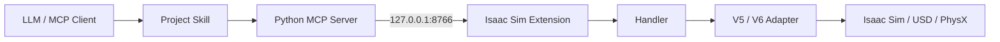

# IsaacSim-MCP

IsaacSim-MCP 讓支援 MCP 的 AI client 透過具名、可驗證的 tools 控制 NVIDIA Isaac Sim。涵蓋 USD 場景、機器人、感測器、物理、Action Graph、ROS 2、Replicator SDG、動畫人物、NVIDIA 資產與模擬控制。

主要驗證環境是 Windows 與 Isaac Sim 6.0.1。本專案延伸自 [whats2000/isaacsim-mcp-server](https://github.com/whats2000/isaacsim-mcp-server)，沿用 MIT License。

## 核心功能

- 建立、查詢、變形、組合、儲存與驗證 USD Stage。
- 控制 articulation、joint drive、motion planning、gripper 與 mobile base。
- 擷取 Camera RGB 與 typed RTX outputs，設定 LiDAR 並取得點雲。
- 建立 PhysX scene、body、collider、joint、PBR material 與 physics material。
- 管理 Action Graph、ScriptNode、ROS 2 publisher、Replicator SDG job 與 human behavior lifecycle。
- 透過 managed artifact 傳輸大型輸出，支援 hash、bounded chunk、TTL 與 cleanup。
- 提供 command ID、idempotency、policy limit、job、cancel、read-back、rollback 與 redacted diagnostics。

[MCP Tool Inventory](docs/reference/TOOL_INVENTORY.md) 由 source decorators 自動產生；目前 runtime 支援狀態以 `get_capabilities` 為準。

## 架構

```text
LLM → Skill → MCP Server → TCP → Isaac Extension → Handler → Adapter → Isaac Sim
```



各層責任、request lifecycle、runtime routes 與權威來源見 [ARCHITECTURE.md](ARCHITECTURE.md)。

## Quick Start

### 1. 安裝 MCP Server

```powershell
git clone https://github.com/Tim0320/IsaacSim-MCP.git
cd IsaacSim-MCP
py -3.10 -m venv .venv
.\.venv\Scripts\python.exe -m pip install --upgrade pip
.\.venv\Scripts\python.exe -m pip install -e .
```

### 2. 啟動 Isaac Sim 與 Extension

```powershell
# 提供env isaacsim安裝路徑
$env:ISAACSIM_ROOT=""
.\scripts\run_isaac_sim.ps1
```

Launcher 會驗證 Isaac Sim 6.0.1、載入 `isaac.sim.mcp_extension`，並在 `127.0.0.1:8766` 啟動 loopback runtime socket。Windows 多 GPU 環境會依 active display GPU 選擇明確的 PhysX GPU ordinal；只有需要刻意覆寫時才使用 `-PhysicsGpu`。

### 3. 設定 MCP Client

```json
{
  "mcpServers": {
    "isaac-sim-live": {
      "command": "D:\\Dev\\IsaacSim-MCP\\.venv\\Scripts\\python.exe",
      "args": ["-m", "isaac_mcp.server"],
      "env": {
        "ISAAC_MCP_HOST": "127.0.0.1",
        "ISAAC_MCP_PORT": "8766"
      }
    }
  }
}
```

先呼叫 `get_capabilities`，再呼叫 `get_scene_info`，確認 runtime 與 Stage 後才執行 write。完整安裝與疑難排解見 [Windows 安裝指南](docs/getting-started/INSTALLATION_WINDOWS.md)。

### ChatGPT / Streamable HTTP

本機 Codex／Claude Desktop 的 stdio transport 仍是預設；沒有設定
`ISAAC_MCP_TRANSPORT` 時，原有啟動方式與 MCP client 設定不變。若要讓
Secure MCP Tunnel 連到本機 MCP server，可在 Windows PowerShell 啟動
Streamable HTTP：

```powershell
$env:ISAAC_MCP_TRANSPORT = "streamable-http"
$env:ISAAC_MCP_HTTP_HOST = "127.0.0.1"
$env:ISAAC_MCP_HTTP_PORT = "8000"

.\.venv\Scripts\python.exe -m isaac_mcp.server
```

MCP HTTP endpoint 是 `http://127.0.0.1:8000/mcp`；`http` 也可作為
`streamable-http` 的 alias。這個 `8000/mcp` endpoint 供 MCP client／tunnel
連線，`127.0.0.1:8766` 則維持為 Python MCP Server 與 Isaac Sim Extension
之間的 runtime TCP socket，兩者用途不同。

## 支援版本

| Component | 狀態 |
|---|---|
| Isaac Sim 6.0.1 on Windows | 主要驗證 runtime |
| PhysX | 透過 V6 adapter 與 guarded live verifier 支援 |
| Newton | 只有 active backend matrix 回報 supported 且 verified 的功能才能使用，其餘 fail closed |
| Isaac Sim 5.1.x | Legacy adapter；不在目前 6.0.1 release gate 範圍 |
| Isaac Lab MCP | 明確延後，與目前 Isaac Sim MCP 分開處理 |

Package、extension、response、capability 與 backend-matrix version 各有獨立相容規則，見 [Protocol versions 與 migration](docs/concepts/PROTOCOL_VERSIONING_AND_MIGRATION.md)。

## 文件入口

從 [docs/README.md](docs/README.md) 開始：

- `getting-started/`：安裝與第一次連線。
- `concepts/`：protocol、transport、governance 與 job 共用模型。
- `reference/`：目前 API 與 capability 契約。
- `development/`：測試、scratch-stage 與 release 流程。
- `research/`：有日期的 1.x～6.x tasks 與 verification snapshots。

Agent 工作流程在 [.agents/skills/omniverse-windows-workspace/SKILL.md](.agents/skills/omniverse-windows-workspace/SKILL.md)。Tool、version 與 capability 的權威來源見 [Authority and Generated Metadata](docs/reference/AUTHORITY.md)。
Agent 的 retry、reconnect、read-back 與 fail-closed 行為見 [Error Codes and Agent Recovery](docs/reference/ERROR_CODES.md)。

## Safety 與 verification

- `isaac-sim-live` 透過 TCP `8766` 控制 Stage；documentation MCP 無法證明 live Stage 已改變。
- Write 必須通過 timeline、backend、extension、ownership 與 path prerequisites。Destructive verification 只允許 exact scratch Stage 與 MCP-owned namespace。
- Registry presence 只證明 tool 可發現。Live pass 必須有 operation-specific read-back 與 cleanup evidence。
- `execute_script`／`reload_script` 只接受可信任程式碼，且受 policy 限制；優先使用 named tools。
- API keys 只供外部資產 provider 選用，不可寫入 source、MCP JSON、report 或 commit。
- Release 前建立 verified backup 並執行 strict [release gate](docs/development/RELEASE_GATE.md)。Commit 與 push 仍需使用者明確授權。

## 開發檢查

```powershell
uv sync --dev
uv run pytest -q -m "not live and not windows_launcher and not unix_launcher" -k "not test_detect_version_returns_zero_on_failure"
uv run ruff check .
.\.venv\Scripts\python.exe .\scripts\generate_tool_inventory.py --check
```

Live tests 是 opt-in，並受 [scratch-stage harness](docs/development/LIVE_TEST_HARNESS.md) 保護。禁止對使用者 Stage 執行 legacy destructive integration suite。

## License

本專案使用 [MIT License](LICENSE)。散布修改版時需保留授權、copyright notices 與 upstream attribution。
